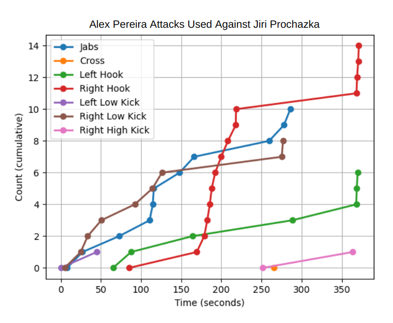

# Posing SMPLX Models

Keeping this short for now(will write full docs later)

## About
This is for a project in my data visualization class.

I saw a LinkedIn post about a guy who used a YOLO keypoints model to count him doing pushups and was curious about doing something similar to track MMA fighters.

Unfortunately I did not have myself enough time to collect data for a classifier which would detect punches/kicks/defensive poses (YOLO also doesn't do hands so it confuses parries with jabs). I had to get my data by manually tallying Alex Pereria's 2024 title defenses

Here's his chart against Jiri Prochazka in 2024

Hooks, uppercuts, and elbows are counted together because they're bent elbow arm attacks. Knees were counted as high or low kicks depending on if they hit chest or below.

The middle section where it is just right hooks was Pereria defending himself in a clinch.

After getting these I took Pereria's 3 most common attacks and rendered them in Blender using the SMPLX model. I'm hoping to get these live so I'm going to experiment with Openpose next when I have time.

Also each hand has 45 joints which I would have to pose individually so the hands are not accurately rendered.

Afterwards I saved the poses to a json and rendered them in pyrender. Then added colors to represent attack amounts and a key using matplotlib to create

and in 3d

## TODO:
Prototype data collection through vision(YOLO Keypoints or Openpose)