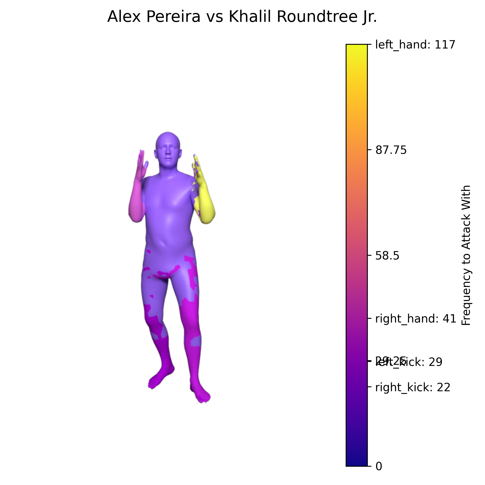

# 3D Attack Use Visualizer

This could also be used for other fighters

## First Push
This is for a project in my data visualization class.

I saw a LinkedIn post about a guy who used a YOLO keypoints model to count him doing pushups and was curious about doing something similar to track MMA fighters.

Unfortunately I did not have myself enough time to collect data for a classifier which would detect punches/kicks/defensive poses (YOLO also doesn't do hands so it confuses parries with jabs).

Since the first push, I've made some progress to the keypoint tracker but it wasn't enough for me to use to gather data for a classfier. Here is a sneak peak anyway:

Y

I had to get my data by manually tallying Alex Pereria's 2024 title defenses. ESPN and Tapogoly don't collect the data I wanted in enough detail (the ESPN data is in [Pereria.csv](Pereria.csv))

Here's Pereria's chart against Jiri Prochazka in 2024


Hooks, uppercuts, and elbows are counted together because they're bent elbow arm attacks. Knees were counted as high or low kicks depending on if they hit chest or below.

The middle section where it is just right hooks was Pereria defending himself in a clinch.

After getting these I took Pereria's 3 most common attacks and rendered them in Blender using the SMPLX model. I'm hoping to get these live so I'm going to experiment with Openpose next when I have time.

Also each hand has 45 joints which I would have to pose individually so the hands are not accurately rendered.

Afterwards I saved the poses to a json and rendered them in pyrender. Then added colors to represent attack amounts and a key using matplotlib to create


and in 3d


## FINAL: Rendering Body Usage on One Figure
Because of the inability to collect pose data I decided to render everything onto a static figure in standing position. 

I decided to pivot from this dilemma by using colors to show **which parts of the body are more utilized for offense** instead of viewing the pose. ESPN's website actually does the opposite of this by **showing which body parts take the most damage**.


Notice how Pereria has no color because he wasn't really being hurt.

In order to show this the manual data I collected is utilized and the frequency of each limb use is placed against a plasma color map. The colors are rendered onto a base blender project using the heatmap_blender.py script to create a scene for imaging this data. 

## Imagery and Analysis

### Here are Pereria's 2024 fights rendered



Although the use of legs and the right hand is kind of inconsistent. There is a clear trend for the use of the left hand(likely for jabs) to keep opponents defensive and prowl for attacks.

## To Run
1. Download [Blender](https://www.blender.org/download/) and ensure it is in PATH
2. Download the readypos.blend file from this location(while my drive lasts): [readypos.blend](https://drive.google.com/file/d/1va6V0Ct8WQellLf9CvR2PZ9-E2C2ZH9A/view?usp=sharing) 
2. Create a similar dataset to [datasets/Manual.csv](datasets/Manual.csv)
3. Setup the inputs at the top [heatmap_wrapper.py](heatmap_wrapper.py) and run the script
```python3 heatmap_wrapper.py```
*I highly recommend running it in this directory because the paths are relative to it*

The wrapper will setup the command needed to run the blender script. It will then take the script's image output and create colorbar for reference.

If you need the model files can be found here: [smplx](https://smpl-x.is.tue.mpg.de/)

## TODO:
Prototype data collection through vision(YOLO Keypoints or Openpose). This is in a seperate repo